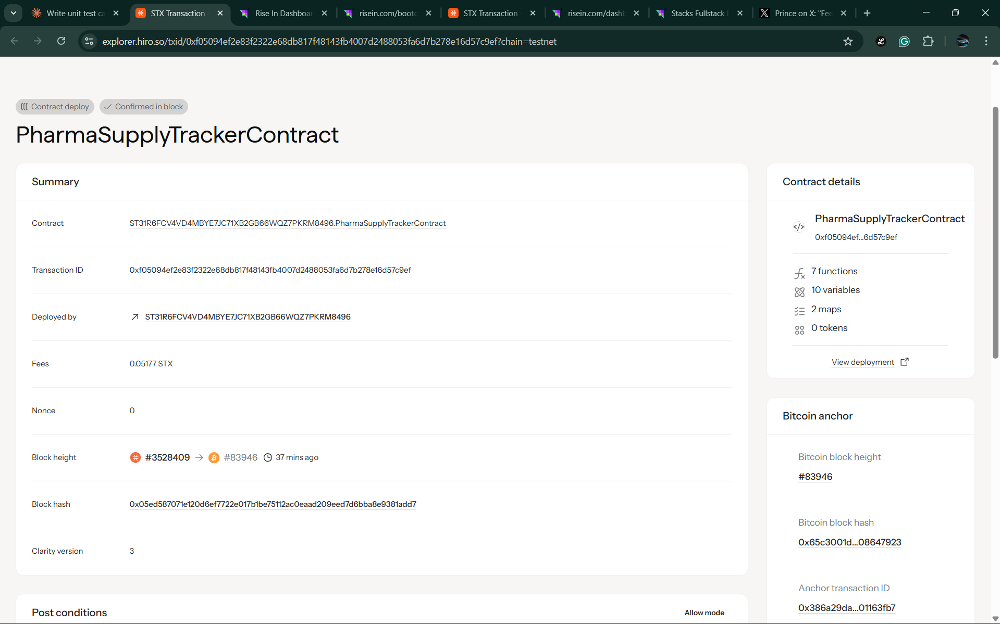

# Pharma Supply Tracker

## Project Description

The Pharma Supply Tracker is a blockchain-based smart contract system built on the Stacks blockchain using Clarity language. This innovative solution addresses critical challenges in pharmaceutical supply chain management by providing immutable verification of drug authenticity and enabling rapid recall mechanisms to prevent counterfeit medications from reaching consumers.

The contract serves as a decentralized ledger that tracks pharmaceutical batches from manufacturing to distribution, ensuring transparency, authenticity, and safety throughout the entire supply chain. By leveraging blockchain technology, we create an tamper-proof record that can be trusted by manufacturers, distributors, pharmacies, regulatory bodies, and consumers.

### Key Features:
- **Immutable Drug Batch Registration**: Secure recording of pharmaceutical batches with comprehensive metadata
- **Manufacturer Authorization System**: Only verified and authorized manufacturers can register drug batches
- **Rapid Recall Mechanism**: Instant recall capabilities with transparent reason tracking
- **Real-time Safety Verification**: Automatic checking for recalled or expired medications
- **Comprehensive Audit Trail**: Complete transparency of drug journey from manufacture to recall
- **Regulatory Compliance**: Built-in compliance features for pharmaceutical regulations

## Project Vision

Our vision is to revolutionize pharmaceutical supply chain security by creating a **zero-counterfeit ecosystem** where every legitimate medication can be instantly verified and every counterfeit drug is immediately detectable. We envision a future where:

- **Patients** have complete confidence in the authenticity and safety of their medications
- **Healthcare providers** can instantly verify drug legitimacy at the point of care
- **Regulatory agencies** have real-time visibility into the entire pharmaceutical supply chain
- **Manufacturers** can protect their brand integrity and quickly respond to quality issues
- **Global health** is protected through rapid identification and containment of counterfeit or compromised medications

By 2030, we aim to be the global standard for pharmaceutical supply chain verification, protecting millions of patients worldwide from the dangers of counterfeit medications and enabling healthcare systems to respond to drug safety issues with unprecedented speed and accuracy.

### Impact Goals:
- **Eliminate counterfeit drugs** from verified supply chains
- **Reduce recall response time** from days to minutes
- **Increase patient safety** through real-time medication verification
- **Enable global interoperability** across different healthcare systems
- **Support regulatory compliance** with automated reporting and audit capabilities

## Future Scope

### Phase 2 Development (Next 6-12 months):
- **Multi-stakeholder Integration**: Extend authorization to distributors, pharmacies, and regulatory bodies
- **IoT Sensor Integration**: Real-time temperature, humidity, and tampering detection
- **Patient-facing Mobile App**: QR code scanning for medication verification
- **Automated Compliance Reporting**: Integration with FDA, EMA, and other regulatory systems
- **Supply Chain Analytics**: Advanced reporting and trend analysis capabilities

### Phase 3 Development (12-24 months):
- **Cross-chain Interoperability**: Integration with other blockchain networks
- **AI-Powered Fraud Detection**: Machine learning algorithms for identifying suspicious patterns
- **Global Standards Integration**: Compatibility with GS1, WHO, and international pharmaceutical standards
- **Advanced Privacy Features**: Zero-knowledge proofs for sensitive supply chain data
- **Decentralized Governance**: Community-driven protocol upgrades and decision making

### Long-term Vision (2-5 years):
- **Global Pharmaceutical Registry**: Universal database of all legitimate medications worldwide
- **Real-time Market Intelligence**: Supply chain optimization and shortage prediction
- **Personalized Medicine Tracking**: Individual patient medication history and interaction tracking
- **Clinical Trial Integration**: Seamless connection with pharmaceutical research and development
- **Insurance and Reimbursement Integration**: Automated claims processing based on verified medications

### Technology Roadmap:
- **Layer 2 Scaling Solutions**: Enhanced transaction throughput for global adoption
- **Quantum-Resistant Security**: Future-proofing against quantum computing threats
- **Advanced Smart Contract Features**: Time-locked contracts, conditional releases, and automated settlements
- **Interplanetary File System (IPFS)**: Decentralized storage for extensive drug documentation
- **Edge Computing Integration**: Local verification capabilities for remote healthcare facilities

### Partnership Opportunities:
- **Pharmaceutical Manufacturers**: Direct integration with manufacturing systems
- **Healthcare Providers**: Hospital and pharmacy management system integration
- **Regulatory Bodies**: Official recognition and mandated usage
- **Technology Partners**: Collaboration with IoT, AI, and blockchain infrastructure providers
- **Global Health Organizations**: Support for developing countries and humanitarian efforts

## Contract Address Details

contract ID:ST31R6FCV4VD4MBYE7JC71XB2GB66WQZ7PKRM8496.PharmaSupplyTrackerContract

### Getting Started

#### Contributing:
We welcome contributions from the community. Please read our contributing guidelines and submit pull requests for any enhancements.

#### License:
This project is licensed under the MIT License - see the LICENSE file for details.

#### Support:
For technical support or partnership inquiries, please contact our development team at [contact information to be added].

---
